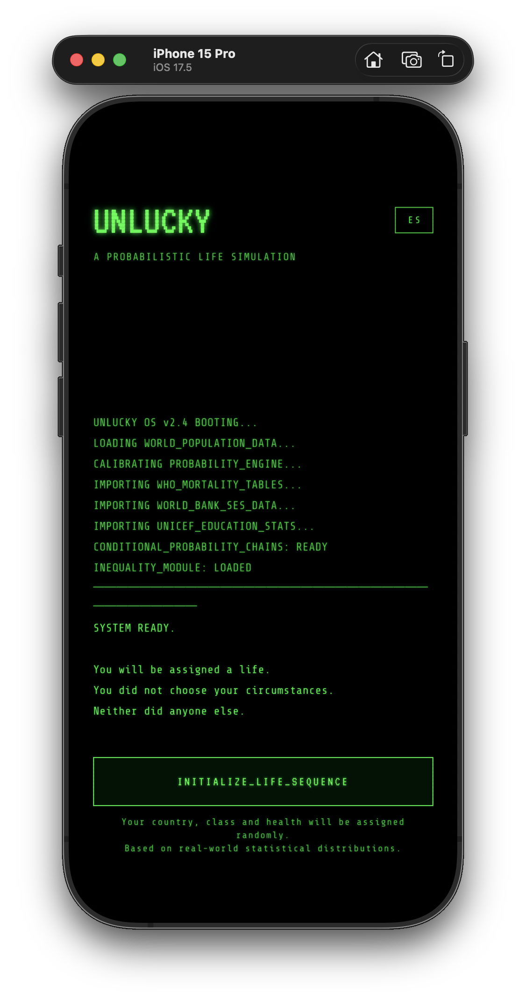
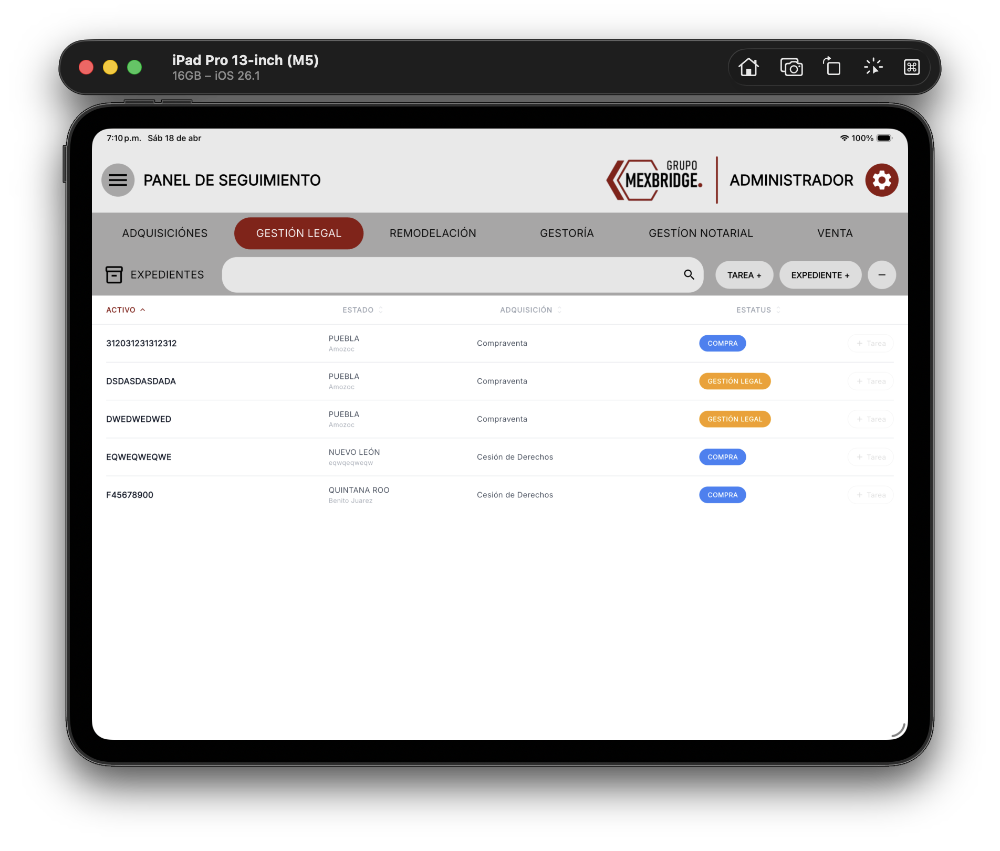
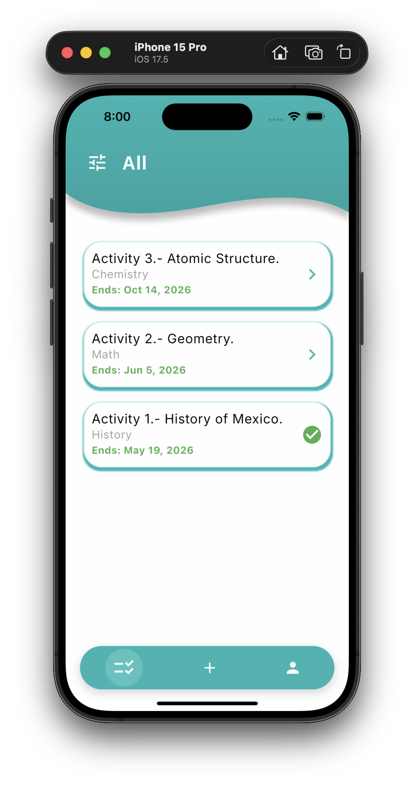

# Mobile Development Portfolio 

*[Léelo en Español](README-es.md)*

Welcome to my mobile development showcase. This repository centralizes my most significant projects, built with **Flutter** and **Dart**. Each application solves specific problems across different sectors: social impact simulation, corporate real estate management, and Educational Technology (EdTech).

---

## 1. UNLUCKY: A Probabilistic Life Simulator.

**UNLUCKY** is a narrative-driven, statistical life simulation. Instead of a traditional action game, it uses a terminal-style UI to simulate the "birth lottery". Every decision is weighted by the socioeconomic circumstances and country of a randomly assigned birth, using real-world data to calculate probability and risk.

### Tech Stack
* **State Management:** Riverpod (focused on absolute immutability).
* **Architecture:** Feature-first modular design.
* **Core Logic:** Custom Probability Engine for risk-vector calculations.
* **Localization:** Native Flutter i18n using .arb files.

<b>Technical Highlights & Architecture</b>

* **Immutability:** Every state change in a "Life Run" creates a new immutable instance, ensuring predictable UI updates and history tracking.
* **UI Strategy:** Leveraged Flutter's native widget system instead of a game engine to maintain high-performance typography and complex layout control.
* **Deterministic Logic:** Implemented a `StatDelta` system that adjusts success rates in real-time based on the player's initial birth profile.
* **Native Localization:** Decoupled UI text from game logic using Application Resource Bundles (.arb), allowing seamless, real-time language switching in a text-heavy narrative.

 

**Note:** This repository is private for commercial purposes.
**[Watch Video Demo](https://youtu.be/0V-P1RplIvc)**

---

## 2. Mex Bridge: Real Estate Management

**Mex Bridge** is a corporate iPad application designed to centralize real estate file management in Mexico. It acts as a command center for administrators to coordinate Legal, Remodeling, and Sales teams by assigning tasks and monitoring property status in real-time.

### Tech Stack
* **Framework:** Flutter (Optimized for iPadOS).
* **Database:** Cloud Firestore (Reactive real-time synchronization).
* **State Management:** Provider.
* **Auth:** Firebase Auth with session persistence.

<b>Technical Overview & Software Engineering Decisions</b>

Since this is a proprietary enterprise project, the source code is not public. However, the development involved several advanced engineering patterns:

* **Granular Role-Based Access Control (RBAC):** Built a custom security layer where access levels are defined by area-specific tokens. This ensures that while the Database is centralized, the UI only renders relevant modules (Legal, Sales, etc.) and restricts write permissions based on the user's role.
* **Complex Form State Orchestration:** Real estate files involve hundreds of data points. I implemented a multi-step state management strategy using **Provider** to ensure data persistence across screens, allowing users to navigate through long forms without data loss before the final sync with Firestore.
* **Relational Data Strategy in NoSQL:** Designed a non-relational schema in **Cloud Firestore** that optimizes queries for property status tracking. I utilized sub-collections for "Tasks" to maintain a clean link between a property's master file and its department-specific updates.
* **Clean Architecture & Repository Pattern:** The project follows a modular structure that decouples UI from business logic. This allows for easier testing and the possibility of migrating the backend in the future without rewriting the entire frontend.

 

**Note:** Proprietary code under NDA (Non-Disclosure Agreement).

---

## 3. Intelliafy: EdTech & Recruitment App

**Intelliafy** is a modern EdTech platform designed for institutions and recruiters. It allows the dynamic creation of multiple-choice exams, deadline assignments, and provides an interactive dashboard for candidates to solve tests and receive instant feedback.

### Tech Stack
* **Backend:** Firebase (Auth, Firestore, Cloud Storage).
* **State Management:** Provider.
* **Features:** Image processing (`image_picker` & `image_cropper`).
* **Optimization:** Custom Barrel Pattern for clean exports.

<b>Technical Highlights & Architecture</b>

* **Real-Time Sync:** Firestore-backed engine ensuring that exam status and scores are updated instantly across all devices.
* **Asset Management:** Integrated Firebase Storage for profile pictures and exam-related media with local cropping capabilities.
* **Modular UI:** Custom curved headers and floating navigation bars built as reusable components for consistency.

 

**[View Source Code](https://github.com/EdgarLopezMX/Intelliafy)**

---

## Core Skills

* **Languages:** Dart, C#.
* **Frameworks:** Flutter (Mobile, Tablet, Desktop).
* **Backend:** Firebase (Auth, Firestore, Functions, Storage).
* **DevOps/Tools:** Git, GitHub, VS Code, Xcode.

---

## Contact & Links

* **LinkedIn:** https://www.linkedin.com/in/edgar-ismael-lópez-rosas-118328191
* **Email:** Edgar.LopezRosas@hotmail.com
* **GitHub:** @EdgarLopezMX
* **Resume:** [Download PDF Here](Edgar_Lopez_CV.pdf)

*Developed in Puebla, Mexico by Edgar Ismael López Rosas.*